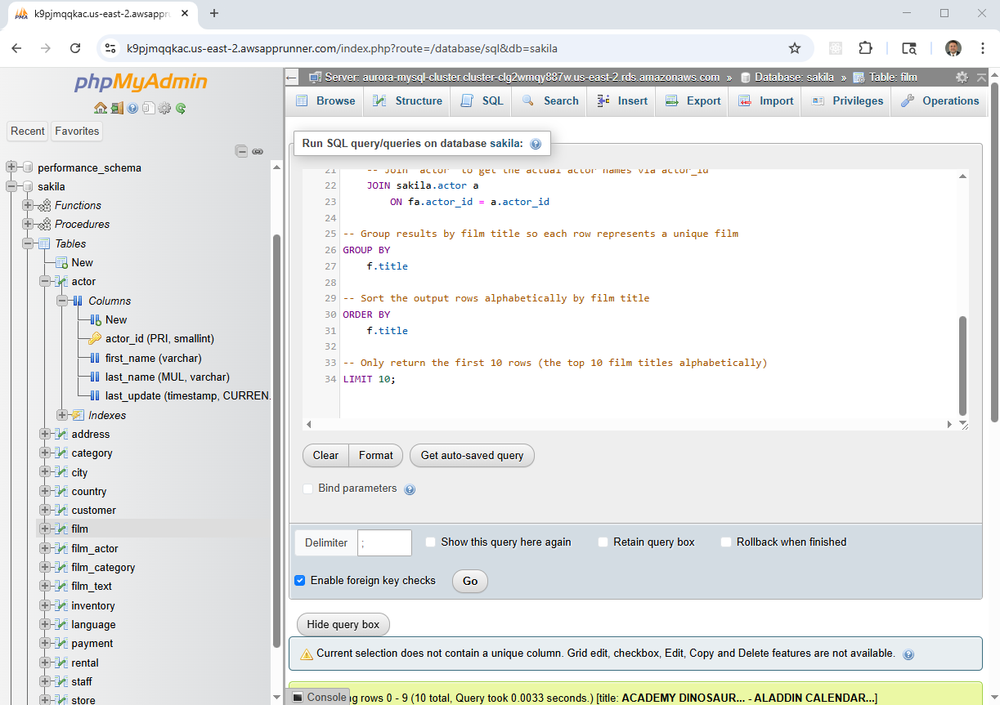

# Deploying MySQL on AWS

This project provides a comprehensive, infrastructure-as-code guide to
deploying MySQL on AWS using two fully managed database services:

- **Amazon RDS for MySQL**
- **Amazon Aurora MySQL-Compatible Edition**

Rather than relying on containerized management services, this implementation
deploys **two dedicated phpMyAdmin servers running on Ubuntu 24.04**—one
connected to RDS and one connected to Aurora. This replaces the previous
App Runner–based approach and provides a simpler, more transparent operational
model.

---

## Architecture Overview

As part of this project:

- Amazon RDS for MySQL and Amazon Aurora MySQL are provisioned using Terraform
- Two Ubuntu 24.04 EC2 instances are deployed:
  - `phpmyadmin-rds` — dedicated to Amazon RDS for MySQL
  - `phpmyadmin-aurora` — dedicated to Amazon Aurora MySQL
- Each phpMyAdmin instance:
  - Resides in the same VPC as its database
  - Uses security groups to restrict access
  - Authenticates using credentials stored in AWS Secrets Manager

The **Sakila** sample database is loaded into both engines to provide a
consistent dataset for testing and comparison.


---

## What You'll Learn

- Architectural differences between RDS MySQL and Aurora MySQL
- How to provision both engines using Terraform
- Differences between RDS read replicas and Aurora readers
- How to deploy and secure phpMyAdmin on EC2
- Best practices for database infrastructure as code on AWS

---

## Comparison of RDS for MySQL and Aurora MySQL

### Overview

- **Amazon RDS for MySQL**  
  A managed MySQL service with automated backups, patching, and scaling.

- **Amazon Aurora MySQL-Compatible Edition**  
  A high-performance MySQL-compatible engine with distributed storage and fast
  failover.

### Key Differences

| Aspect | Amazon RDS for MySQL | Amazon Aurora MySQL-Compatible |
|------|----------------------|--------------------------------|
| Storage | EBS-backed, manual scaling | Distributed, auto-scaling |
| Performance | General-purpose | Up to 5× throughput |
| HA & Failover | 60–120s | Sub-30s |
| Replication | Async read replicas | Up to 15 low-latency readers |
| Cost | Lower | Higher, performance-optimized |

---

## Prerequisites

- AWS Account
- AWS CLI
- Terraform (latest)
- MySQL client (`apt install mysql-client`)

If this is your first time working with Terraform on AWS, start here:
[AWS + Terraform: Easy Setup](https://youtu.be/BCMQo0CB9wk)

---

## Download the Repository

```bash
git clone https://github.com/mamonaco1973/aws-mysql.git
cd aws-mysql
```

---

## Build the Infrastructure

Run the environment validation script, then apply the Terraform stack:

```bash
./check_env.sh
./apply.sh
```

Terraform provisions:

### Networking
- Custom VPC
- Public subnets
- Internet Gateway
- Route tables

### Security
- Database security groups
- phpMyAdmin security groups

### Secrets
- `mysql_credentials`
- `aurora_credentials`

### Databases
- Amazon RDS MySQL instance + read replica
- Amazon Aurora MySQL cluster with writer and reader

### phpMyAdmin Servers
- Ubuntu 24.04 EC2 instance for RDS
- Ubuntu 24.04 EC2 instance for Aurora
- Apache + PHP + phpMyAdmin installed via cloud-init

---

## Accessing phpMyAdmin

Each database engine has its own dedicated phpMyAdmin endpoint.



Use the credentials stored in AWS Secrets Manager to authenticate.

---

## Sample Queries (Sakila)

### Query 1
```sql
SELECT
    f.title AS film_title,
    CONCAT(a.first_name, ' ', a.last_name) AS actor_name
FROM sakila.film f
JOIN sakila.film_actor fa ON f.film_id = fa.film_id
JOIN sakila.actor a ON fa.actor_id = a.actor_id
ORDER BY f.title, actor_name
LIMIT 20;
```

### Query 2
```sql
SELECT
    f.title,
    GROUP_CONCAT(
        CONCAT(a.first_name, ' ', a.last_name)
        ORDER BY a.last_name
        SEPARATOR ', '
    ) AS actor_names
FROM sakila.film f
JOIN sakila.film_actor fa ON f.film_id = fa.film_id
JOIN sakila.actor a ON fa.actor_id = a.actor_id
GROUP BY f.title
ORDER BY f.title
LIMIT 10;
```

---

## Cleanup

When you are finished evaluating this project, please clean up your AWS
resources:

```bash
./destroy.sh
```

This ensures no unnecessary resources continue running in your account.
