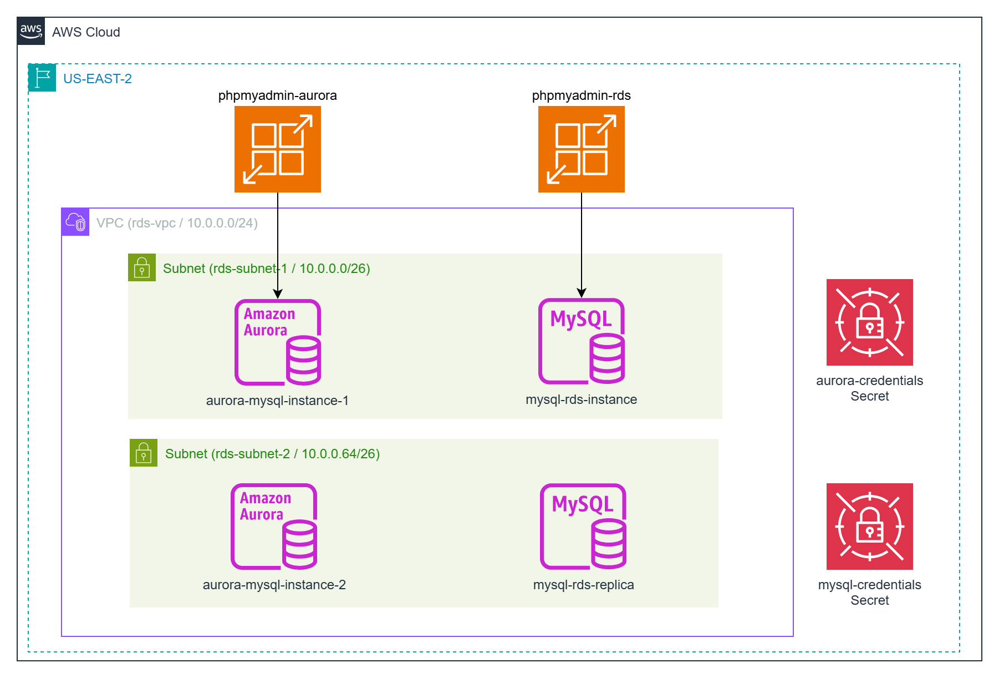

# Deploying MySQL in AWS

This project provides a comprehensive guide to deploying MySQL on AWS using two fully managed database services: Amazon RDS for MySQL and Amazon Aurora MySQL-Compatible Edition. These services enable developers and organizations to set up, operate, and scale MySQL databases in the cloud with ease, eliminating the need for manual infrastructure management.

Whether you're creating a lightweight development environment for testing or a robust, production-grade backend for mission-critical applications, AWS offers flexible deployment options tailored to diverse needs.

Each service—Amazon RDS for MySQL and Amazon Aurora MySQL-Compatible Edition—comes with distinct performance characteristics, feature sets, and cost profiles, allowing you to choose the best fit for your use case. Amazon RDS provides a straightforward, managed MySQL experience with automated backups, patching, and scaling, while Aurora offers enhanced performance and high availability through its distributed storage architecture.

As part of this project, we deploy the [Sakila](https://dev.mysql.com/doc/sakila/en/) sample database, a well-known MySQL dataset modeled after a fictional DVD rental store. This allows you to test and explore the functionality of your deployed database in a practical, real-world-inspired scenario.



## What You'll Learn

- The core differences between RDS MySQL and Aurora MySQL
- How to provision each database using Terraform
- The distinction between Aurora readers and RDS read replicas
- Best practices for security, scalability, and infrastructure-as-code deployment

## Comparison of RDS for MySQL and Aurora MySQL

When deploying MySQL on AWS, Amazon RDS for MySQL and Amazon Aurora MySQL-Compatible Edition are two fully managed options. Both simplify database management, but they differ in architecture, performance, and cost. This document compares them to help you choose the right service for your application.

### Overview

- **Amazon RDS for MySQL**: A managed service offering standard MySQL with automated backups, patching, and scaling. Ideal for cost-effective, general-purpose workloads.

- **Amazon Aurora MySQL**: A high-performance, MySQL-compatible engine with distributed storage, designed for scalability and enterprise-grade applications.

## Key Differences

| **Aspect**                     | **Amazon RDS for MySQL**                                                                                                    | **Amazon Aurora MySQL-Compatible**                                                                                                                |
|--------------------------------|-----------------------------------------------------------------------------------------------------------------------------|---------------------------------------------------------------------------------------------------------------------------------------------------|
| **Architecture and Storage**   | Standard MySQL with EBS storage; storage provisioned manually (up to 64 TB) and scaling may involve downtime               | Distributed storage across multiple AZs; auto-scaling up to 128 TB with no downtime                                                              |
| **Performance**                | Reliable for standard workloads; limited by EBS and single-instance architecture                                           | Up to 5× throughput; features like parallel query execution                                                                                       |
| **High Availability & Replication** | Multi-AZ deployments; failover in 60–120 seconds; asynchronous read replicas                                                | Faster failover (<30 s); up to 15 low-latency read replicas; Aurora Global Database for cross-region replication                                  |
| **Scalability**                | Vertical scaling and read replicas; storage scaling may involve downtime                                                   | Seamless compute and storage scaling; Aurora Serverless supports variable workloads                                                               |
| **Cost**                       | More affordable for smaller, predictable workloads                                                                         | Higher cost reflecting advanced performance; Aurora Serverless can reduce costs for variable usage                                               |
| **Features & Compatibility**   | Full MySQL compatibility with most plugins and tools                                                                       | MySQL-compatible but may lack some less common features; unique capabilities such as Backtrack and parallel query                                 |
| **Backup & Recovery**          | Automated backups (up to 35 days) and point-in-time recovery; slower restores for large databases                          | Faster backups and restores; Backtrack enables near-instant point-in-time recovery                                                               |
| **Use Cases**                  | Best for cost-conscious, general-purpose workloads and development environments                                            | Ideal for high-performance, mission-critical workloads; Serverless option for variable demand                                                    |

## Choosing the Right Service

- **Choose RDS if**: You need a cost-effective, fully compatible MySQL solution for standard workloads.
- **Choose Aurora if**: Your application demands high performance, scalability, or advanced features like global replication.

## Prerequisites

* [An AWS Account](https://aws.amazon.com/console/)
* [Install AWS CLI](https://docs.aws.amazon.com/cli/latest/userguide/getting-started-install.html) 
* [Install Latest Terraform](https://developer.hashicorp.com/terraform/install)
* [MySQL `myqsl` client](https://www.bytebase.com/reference/mysql/how-to/how-to-install-mysql-client-on-mac-ubuntu-centos-windows/) - `apt install mysql`
* [MySQL Workbench](https://dev.mysql.com/downloads/workbench/)

If this is your first time watching our content, we recommend starting with this video: [AWS + Terraform: Easy Setup](https://youtu.be/BCMQo0CB9wk). It provides a step-by-step guide to properly configure Terraform, Packer, and the AWS CLI.

## Download this Repository

```bash
git clone https://github.com/mamonaco1973/aws-mysql.git
cd aws-mysql
```

## Build the Code

Run [check_env](check_env.sh) then run [apply](apply.sh).

```bash
~/aws-mysql$ ./apply.sh
NOTE: Validating that required commands are found in your PATH.
NOTE: aws is found in the current PATH.
NOTE: psql is found in the current PATH.
NOTE: terraform is found in the current PATH.
NOTE: jq is found in the current PATH.
NOTE: All required commands are available.
NOTE: Checking AWS cli connection.
NOTE: Successfully logged into AWS.
NOTE: Building Database Instances.
Initializing the backend...
Initializing provider plugins...
- Reusing previous version of hashicorp/aws from the dependency lock file
- Reusing previous version of hashicorp/random from the dependency lock file
- Using previously-installed hashicorp/aws v6.0.0
- Using previously-installed hashicorp/random v3.7.2
Terraform has been successfully initialized!
```
## Build Results

After applying the Terraform scripts, the following AWS resources will be created:

### VPC & Subnets
- Custom VPC: `rds-vpc`
- Two public subnets for database placement:
  - `rds-subnet-1`
  - `rds-subnet-2`
- Internet Gateway: `rds-igw`
- Public route table with default route

### Security Groups
- Security Group: `rds_sg`  
  (Allows access to MySQL)

### Secrets & Credentials
- Secrets Manager entries:
  - `aurora_credentials`
  - `mysql_credentials`
- Secrets stored via `aws_secretsmanager_secret_version`
- Random passwords generated using `random_password` for each engine

### RDS MySQL
- Primary RDS instance: `mysql_rds`
- Read Replica: `mysql_rds_replica`
- Subnet group: `rds_subnet_group`

### Aurora MySQL
- Aurora Cluster: `aurora_cluster`
- Writer instance: `aurora_instance_writer`
- Reader instance: `aurora_instance_reader`
- Subnet group: `aurora_subnet_group`

## MySQL WorkBench Demo


Query 1:
```sql
SELECT
    -- Select the film title from the 'film' table and label the column 'film_title'
    f.title AS film_title,

    -- Concatenate the actor's first and last name with a space between them and label the column 'actor_name'
    CONCAT(a.first_name, ' ', a.last_name) AS actor_name

FROM
    -- Use the 'film' table as the main source of data (alias 'f')
    sakila.film f

    -- Join the 'film_actor' link table to associate films with their actors by film_id
    JOIN sakila.film_actor fa
        ON f.film_id = fa.film_id

    -- Join the 'actor' table to get actor name details by actor_id
    JOIN sakila.actor a
        ON fa.actor_id = a.actor_id

-- Sort the results first by film title alphabetically, then by actor name alphabetically within each film
ORDER BY
    f.title,
    actor_name

-- Return only the first 20 rows of the result set
LIMIT 20;                                                   
```

Query 2:

```sql
SELECT
    -- Select the film title from the 'film' table
    f.title,

    -- Concatenate all actor full names (first + last name) into a single string
    -- GROUP_CONCAT builds this list, ordering by actor last name, separating each with a comma and space
    GROUP_CONCAT(
        CONCAT(a.first_name, ' ', a.last_name)
        ORDER BY a.last_name
        SEPARATOR ', '
    ) AS actor_names

FROM
    -- Use the 'film' table as the starting point (aliased as 'f')
    sakila.film f

    -- Join 'film_actor' to link films to their actors via film_id
    JOIN sakila.film_actor fa
        ON f.film_id = fa.film_id

    -- Join 'actor' to get the actual actor names via actor_id
    JOIN sakila.actor a
        ON fa.actor_id = a.actor_id

-- Group results by film title so each row represents a unique film
GROUP BY
    f.title

-- Sort the output rows alphabetically by film title
ORDER BY
    f.title

-- Only return the first 10 rows (the top 10 film titles alphabetically)
LIMIT 10;
```

